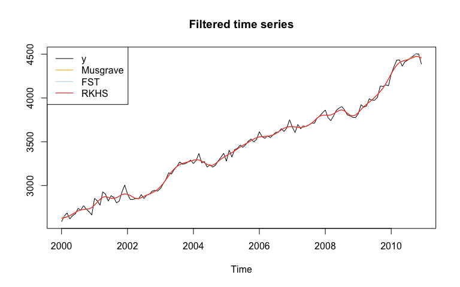
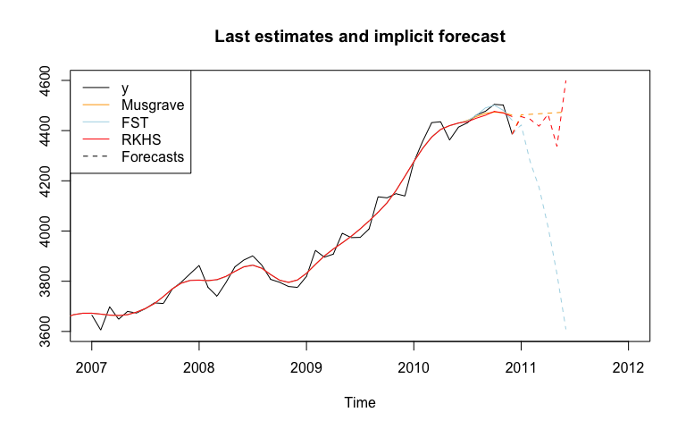
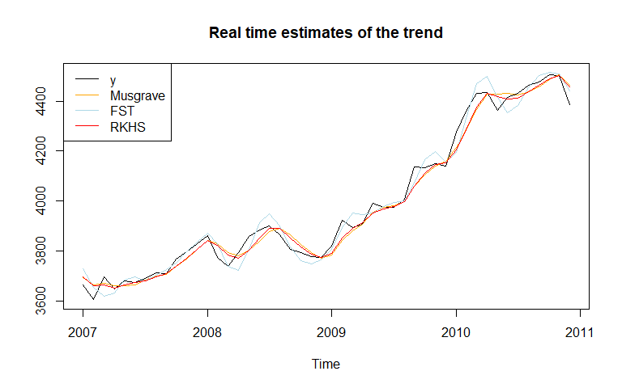
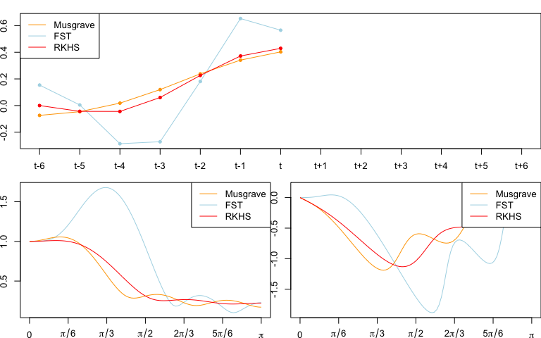
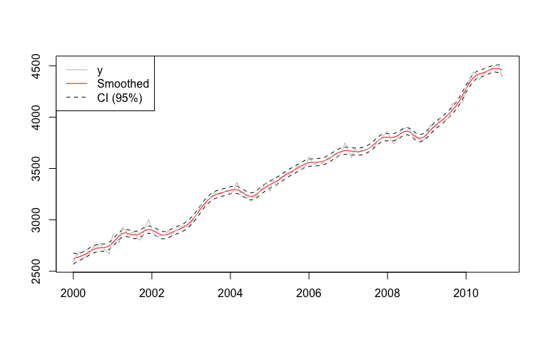
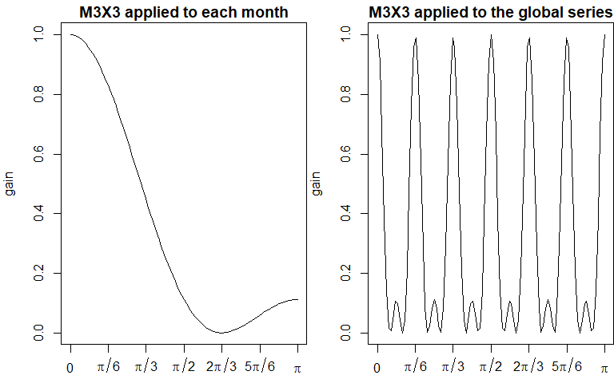

<!-- README.md is generated from README.Rmd. Please edit that file -->

# `rjd3filters` <a href="https://rjdverse.github.io/rjd3filters/"></a>

<!-- badges: start -->

[](https://CRAN.R-project.org/package=rjd3filters)

[](https://github.com/rjdverse/rjd3filters/actions/workflows/R-CMD-check.yaml)
[](https://github.com/rjdverse/rjd3filters/actions/workflows/lint.yaml)

[](https://github.com/rjdverse/rjd3filters/actions/workflows/pkgdown.yaml)
<!-- badges: end -->

rjd3filters is an R package on linear filters for real-time trend-cycle
estimates. It allows to create symmetric and asymmetric moving averages
with:

- local polynomial filters, as defined by Proietti and Luati (2008);

- the FST approach of Grun-Rehomme, Guggemos, and Ladiray (2018), based
  on the optimization of the three criteria Fidelity, Smoothness and
  Timeliness;

- the Reproducing Kernel Hilbert Space (RKHS) of Dagum and Bianconcini
  (2008).

Some quality criteria defined by Wildi and McElroy (2019) can also be
computed.

## Installation

rjd3filters relies on the
[rJava](https://CRAN.R-project.org/package=rJava) package.

Running rjd3 packages requires **Java 17 or higher**. How to set up such
a configuration in R is explained
[here](https://jdemetra-new-documentation.netlify.app/#Rconfig)

To get the current stable version (from the latest release):

``` r
# install.packages("remotes")
remotes::install_github("rjdverse/rjd3toolkit@*release")
remotes::install_github("rjdverse/rjd3filters@*release")
```

To get the current development version from GitHub:

``` r
# install.packages("remotes")
# Install development version from GitHub
remotes::install_github("rjdverse/rjd3toolkit")
remotes::install_github("rjdverse/rjd3filters")
```

## Basic example

In this example we use the same symmetric moving average (Henderson),
but we use three different methods to compute asymmetric filters. As a
consequence, the filtered time series is the same, except at the
boundaries.

``` r
library("rjd3filters")

y <- window(retailsa$AllOtherGenMerchandiseStores, start = 2000)
musgrave <- lp_filter(horizon = 6, kernel = "Henderson", endpoints = "LC")

# we put a large weight on the timeliness criteria
fst_notimeliness_filter <- lapply(0:6, fst_filter, 
                                  lags = 6, smoothness.weight = 1/1000, 
                                  timeliness.weight = 1-1/1000, pdegree =2)
fst_notimeliness <- finite_filters(sfilter = fst_notimeliness_filter[[7]], 
                                   rfilters = fst_notimeliness_filter[-7], 
                                   first_to_last = TRUE)
# RKHS filters minimizing timeliness
rkhs_timeliness <- rkhs_filter(horizon = 6, asymmetricCriterion = "Timeliness")

trend_musgrave <- filter(y, musgrave)
trend_fst <- filter(y, fst_notimeliness)
trend_rkhs <- filter(y, rkhs_timeliness)
plot(ts.union(y, trend_musgrave, trend_fst, trend_rkhs), plot.type = "single", 
     col = c("black", "orange", "lightblue", "red"), 
     main = "Filtered time series", ylab=NULL)
legend("topleft", legend = c("y", "Musgrave", "FST", "RKHS"), 
       col= c("black", "orange", "lightblue", "red"), lty = 1)
```



The last estimates can also be analysed with the `implicit_forecast`
function that retreive the implicit forecasts corresponding to the
asymmetric filters (i.e., the forecasts needed to have the same
end-points estimates but using the symmetric filter).

``` r
f_musgrave <- implicit_forecast(y, musgrave)
f_fst <- implicit_forecast(y, fst_notimeliness)
f_rkhs <- implicit_forecast(y, rkhs_timeliness)

plot(window(y, start = 2007), 
     xlim = c(2007, 2012), ylim = c(3600, 4600), 
     main = "Last estimates and implicit forecast", ylab=NULL)
lines(trend_musgrave, 
      col = "orange")
lines(trend_fst, 
      col = "lightblue")
lines(trend_rkhs, 
      col = "red")
lines(ts(c(tail(y, 1), f_musgrave), frequency = frequency(y), start = end(y)), 
      col = "orange", lty = 2)
lines(ts(c(tail(y, 1), f_fst), frequency = frequency(y), start = end(y)), 
      col = "lightblue", lty = 2)
lines(ts(c(tail(y, 1), f_rkhs), frequency = frequency(y), start = end(y)), 
      col = "red", lty = 2)
legend("topleft", legend = c("y", "Musgrave", "FST", "RKHS", "Forecasts"), 
       col= c("black", "orange", "lightblue", "red", "black"), 
       lty = c(1, 1, 1, 1, 2))
```



The real-time estimates (when no future points are available) can also
be compared:

``` r
trend_henderson<- filter(y, musgrave[, "q=6"])
trend_musgrave_q0 <- filter(y, musgrave[, "q=0"])
trend_fst_q0 <- filter(y, fst_notimeliness[, "q=0"])
trend_rkhs_q0 <- filter(y, rkhs_timeliness[, "q=0"])
plot(window(ts.union(y, trend_musgrave_q0, trend_fst_q0, trend_rkhs_q0), 
            start = 2007), 
     plot.type = "single", 
     col = c("black", "orange", "lightblue", "red"), 
     main = "Real time estimates of the trend", ylab=NULL)
legend("topleft", legend = c("y", "Musgrave", "FST", "RKHS"), 
       col= c("black", "orange", "lightblue", "red"), lty = 1)
```



### Comparison of the filters

Different quality criteria from Grun-Rehomme *et al* (2018) and Wildi
and McElroy(2019) can also be computed with the function
`diagnostic_matrix()`:

``` r
q_0_coefs <- list(Musgrave = musgrave[, "q=0"], 
                  fst_notimeliness = fst_notimeliness[, "q=0"], 
                  rkhs_timeliness = rkhs_timeliness[, "q=0"])

sapply(X = q_0_coefs, 
       FUN = diagnostic_matrix, 
       lags = 6, 
       sweights = musgrave[, "q=6"])
#>         Musgrave fst_notimeliness rkhs_timeliness
#> b_c  0.000000000     2.220446e-16     0.000000000
#> b_l -0.575984377    -1.554312e-15    -0.611459167
#> b_q -1.144593858     1.554312e-15     0.027626749
#> F_g  0.357509832     9.587810e-01     0.381135700
#> S_g  1.137610871     2.402400e+00     1.207752284
#> T_g  0.034088260     4.676398e-04     0.023197411
#> A_w  0.008306348     1.823745e-02     0.003677964
#> S_w  0.449956378     3.575634e+00     0.628156109
#> T_w  0.061789932     7.940547e-04     0.043540181
#> R_w  0.299548665     1.721377e-01     0.219948644
```

The filters can also be compared by plotting there coefficients
(`plot_coef`), gain function (`plot_gain`) and phase function
(`plot_phase`):

``` r
def.par <- par(no.readonly = TRUE)
par(mai = c(0.3, 0.3, 0.2, 0))
layout(matrix(c(1, 1, 2, 3), 2, 2, byrow = TRUE))

plot_coef(fst_notimeliness, q = 0, col = "lightblue")
plot_coef(musgrave, q = 0, add = TRUE, col = "orange")
plot_coef(rkhs_timeliness, q = 0, add = TRUE, col = "red")
legend("topleft", legend = c("Musgrave", "FST", "RKHS"), 
       col= c("orange", "lightblue", "red"), lty = 1)

plot_gain(fst_notimeliness, q = 0, col = "lightblue")
plot_gain(musgrave, q = 0, col = "orange", add = TRUE)
plot_gain(rkhs_timeliness, q = 0, add = TRUE, col = "red")
legend("topright", legend = c("Musgrave", "FST", "RKHS"), 
       col= c("orange", "lightblue", "red"), lty = 1)

plot_phase(fst_notimeliness, q = 0, col = "lightblue")
plot_phase(musgrave, q = 0, col = "orange", add = TRUE)
plot_phase(rkhs_timeliness, q = 0, add = TRUE, col = "red")
legend("topright", legend = c("Musgrave", "FST", "RKHS"), 
       col= c("orange", "lightblue", "red"), lty = 1)
par(def.par)
```



Confidence intervals can also be computed with the `confint_filter`
function:

``` r
confint <- confint_filter(y, musgrave)

plot(confint, plot.type = "single",
     col = c("red", "black", "black"),
     lty = c(1, 2, 2), xlab = NULL, ylab = NULL)
lines(y, col = "grey")
legend("topleft", legend = c("y", "Smoothed", "CI (95%)"), 
       col= c("grey", "red", "black"), lty = c(1, 1, 2))
```



### Manipulate moving averages

You can also create and manipulate moving averages with the class
`moving_average`. In the next examples we show how to create the M2X12
moving average, the first moving average used to extract the trend-cycle
in X-11, and the M3X3 moving average, applied to each months to extract
seasonal component.

``` r
e1 <- moving_average(rep(1, 12), lags = -6)
e1 <- e1/sum(e1)
e2 <- moving_average(rep(1/12, 12), lags = -5)
M2X12 <- (e1 + e2)/2
coef(M2X12)
#>        t-6        t-5        t-4        t-3        t-2        t-1          t 
#> 0.04166667 0.08333333 0.08333333 0.08333333 0.08333333 0.08333333 0.08333333 
#>        t+1        t+2        t+3        t+4        t+5        t+6 
#> 0.08333333 0.08333333 0.08333333 0.08333333 0.08333333 0.04166667
```

``` r
M3 <- moving_average(rep(1/3, 3), lags = -1)
M3X3 <- M3 * M3
# M3X3 moving average applied to each month
M3X3
#> [1] "0.1111 B^2 + 0.2222 B + 0.3333 + 0.2222 F + 0.1111 F^2"
```

``` r
M3X3_seasonal <- to_seasonal(M3X3, 12)
# M3X3_seasonal moving average applied to the global series
M3X3_seasonal
#> [1] "0.1111 B^24 + 0.2222 B^12 + 0.3333 + 0.2222 F^12 + 0.1111 F^24"
```

``` r

def.par <- par(no.readonly = TRUE)
par(mai = c(0.5, 0.8, 0.3, 0))
layout(matrix(c(1, 2), nrow = 1))
plot_gain(M3X3, main = "M3X3 applied to each month")
plot_gain(M3X3_seasonal, main = "M3X3 applied to the global series")
```



``` r
par(def.par)

# To apply the moving average
t <- y * M2X12
si <- y - t
s <- si * M3X3_seasonal
# or equivalently:
s_mm <- M3X3_seasonal * (1 - M2X12)
s <- y * s_mm
```

### Manipulate finite filters

`finite_filters` object are a combination of a central filter (used for
the final estimates) and different asymmetric filters used for
intermediate estimates at the beginning/end of the series when the
central filter cannot be applied.

``` r
musgrave 
#>             q=6          q=5          q=4          q=3          q=2
#> t-6 -0.01934985 -0.016609040 -0.011623676 -0.009152423 -0.016139228
#> t-5 -0.02786378 -0.025914479 -0.022541271 -0.020981640 -0.024948087
#> t-4  0.00000000  0.001157790  0.002918842  0.003566851  0.002620762
#> t-3  0.06549178  0.065858066  0.066006963  0.065743350  0.067817618
#> t-2  0.14735651  0.146931288  0.145468029  0.144292794  0.149387420
#> t-1  0.21433675  0.213120014  0.210044599  0.207957742  0.216072726
#> t    0.24005716  0.238048915  0.233361346  0.230362866  0.241498208
#> t+1  0.21433675  0.211536998  0.205237273  0.201327171  0.215482871
#> t+2  0.14735651  0.143765257  0.135853376  0.131031652  0.148207710
#> t+3  0.06549178  0.061109020  0.051584983  0.045851637  0.000000000
#> t+4  0.00000000 -0.005174272 -0.016310464  0.000000000  0.000000000
#> t+5 -0.02786378 -0.033829557  0.000000000  0.000000000  0.000000000
#> t+6 -0.01934985  0.000000000  0.000000000  0.000000000  0.000000000
#>              q=1         q=0
#> t-6 -0.037925830 -0.07371504
#> t-5 -0.035216813 -0.04601336
#> t-4  0.003869912  0.01806602
#> t-3  0.080584644  0.11977342
#> t-2  0.173672322  0.23785375
#> t-1  0.251875504  0.34104960
#> t    0.288818862  0.40298562
#> t+1  0.274321400  0.00000000
#> t+2  0.000000000  0.00000000
#> t+3  0.000000000  0.00000000
#> t+4  0.000000000  0.00000000
#> t+5  0.000000000  0.00000000
#> t+6  0.000000000  0.00000000
```

``` r
musgrave * M3X3
#>              q=6          q=5          q=4           q=3          q=2
#> t-8 -0.002149983 -0.001845449 -0.001291520 -0.0010169359 -0.001793248
#> t-7 -0.007395941 -0.006570284 -0.005087625 -0.0043651651 -0.006358505
#> t-6 -0.012641899 -0.011166476 -0.008559414 -0.0073170774 -0.010632566
#> t-5 -0.006311026 -0.004754208 -0.002114058 -0.0009303015 -0.003784842
#> t-4  0.022584742  0.023742532  0.025503585  0.0261515939  0.025205505
#> t-3  0.075295705  0.075661988  0.075810884  0.0755472713  0.077621540
#> t-2  0.137975973  0.137550748  0.136087489  0.1349122536  0.140006880
#> t-1  0.188629568  0.187412835  0.184337420  0.1822505629  0.190365547
#> t    0.208025720  0.206017479  0.201329910  0.1983314300  0.209466772
#> t+1  0.188629568  0.185829819  0.179530094  0.1756199919  0.182437019
#> t+2  0.137975973  0.134384717  0.126472836  0.1242017153  0.124120786
#> t+3  0.075295705  0.070912941  0.066564227  0.0667717095  0.056877588
#> t+4  0.022584742  0.020311263  0.021121328  0.0247483251  0.016467523
#> t+5 -0.006311026 -0.005636466  0.002107117  0.0050946263  0.000000000
#> t+6 -0.012641899 -0.008092598 -0.001812274  0.0000000000  0.000000000
#> t+7 -0.007395941 -0.003758840  0.000000000  0.0000000000  0.000000000
#> t+8 -0.002149983  0.000000000  0.000000000  0.0000000000  0.000000000
#>              q=1         q=0
#> t-8 -0.004213981 -0.00819056
#> t-7 -0.012340941 -0.02149372
#> t-6 -0.020037912 -0.03278954
#> t-5 -0.010353070 -0.01439608
#> t-4  0.026454654  0.04065076
#> t-3  0.090388566  0.12957734
#> t-2  0.164291782  0.22847321
#> t-1  0.226168325  0.26940011
#> t    0.232502524  0.23654553
#> t+1  0.183608603  0.12744676
#> t+2  0.093051296  0.04477618
#> t+3  0.030480156  0.00000000
#> t+4  0.000000000  0.00000000
#> t+5  0.000000000  0.00000000
#> t+6  0.000000000  0.00000000
#> t+7  0.000000000  0.00000000
#> t+8  0.000000000  0.00000000
```

## Bibliography

Dagum, Estela Bee and Silvia Bianconcini (2008). “The Henderson Smoother
in Reproducing Kernel Hilbert Space”. In: *Journal of Business &
Economic Statistics 26*, pp. 536–545. URL:
<https://ideas.repec.org/a/bes/jnlbes/v26y2008p536-545.html>.

Grun-Rehomme, Michel, Fabien Guggemos, and Dominique Ladiray (2018).
“Asymmetric Moving Averages Minimizing Phase Shift”. In: *Handbook on
Seasonal Adjustment*. URL:
<https://ec.europa.eu/eurostat/web/products-manuals-and-guidelines/-/KS-GQ-18-001>.

Proietti, Tommaso and Alessandra Luati (Dec. 2008). “Real time
estimation in local polynomial regression, with application to
trend-cycle analysis”. In: *Ann. Appl. Stat.* 2.4, pp. 1523–1553. URL:
<https://doi.org/10.1214/08-AOAS195>.

Wildi, Marc and Tucker McElroy (2019). “The trilemma between accuracy,
timeliness and smoothness in real-time signal extraction”. In:
*International Journal of Forecasting* 35.3, pp. 1072–1084. URL:
[https://EconPapers.repec.org/RePEc:eee:intfor:v<wbr>:35:y:2019:i:3:p:1072-1084](https://EconPapers.repec.org/RePEc:eee:intfor:v:35:y:2019:i:3:p:1072-1084).

## Package Maintenance and contributing

Any contribution is welcome and should be done through pull requests
and/or issues. pull requests should include **updated tests** and
**updated documentation**. If functionality is changed, docstrings
should be added or updated.

## Licensing

The code of this project is licensed under the [European Union Public
Licence
(EUPL)](https://joinup.ec.europa.eu/collection/eupl/eupl-text-eupl-12).
