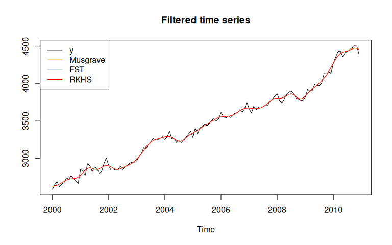
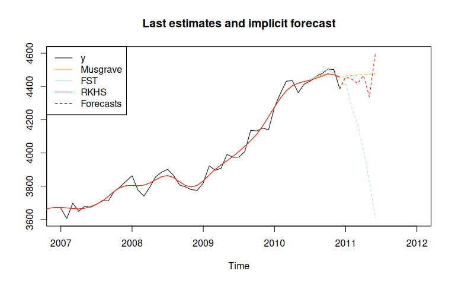
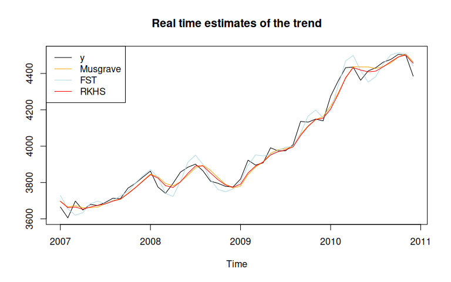
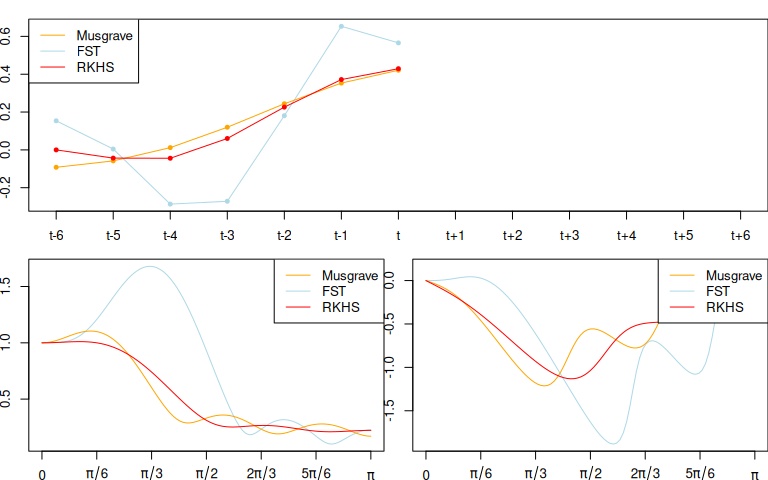
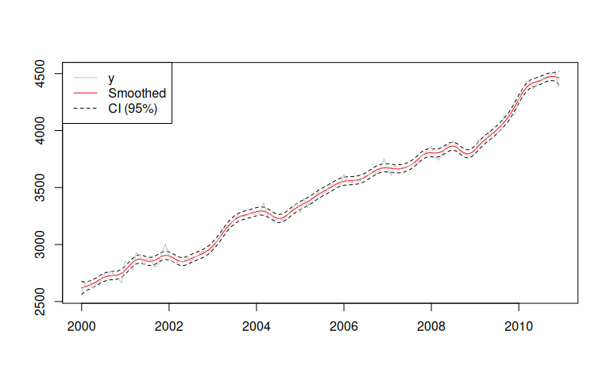
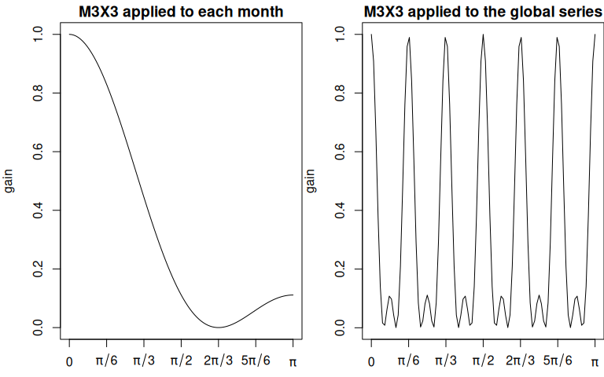

# `rjd3filters`

[](https://github.com/rjdverse/rjd3filters/actions/workflows/R-CMD-check.yml)
[](https://github.com/rjdverse/rjd3filters/actions/workflows/lint.yml)

[](https://github.com/rjdverse/rjd3filters/actions/workflows/pkgdown.yml)

rjd3filters is an R package on linear filters for real-time trend-cycle
estimates. It allows to create symmetric and asymmetric moving averages
with:

- local polynomial filters, as defined by Proietti and Luati (2008);

- the FST approach of Grun-Rehomme, Guggemos, and Ladiray (2018), based
  on the optimization of the three criteria Fidelity, Smoothness and
  Timeliness;

- the Reproducing Kernel Hilbert Space (RKHS) of Dagum and Bianconcini
  (2008).

Some quality criteria defined by Wildi and McElroy (2019) can also be
computed.

## Installation

rjd3filters relies on the
[rJava](https://CRAN.R-project.org/package=rJava) package.

Running rjd3 packages requires **Java 21 or higher**. How to set up such
a configuration in R is explained
[here](https://doc.jdemetra.org/#Rconfig).

### Latest release

To get the current stable version (from the latest release):

- From GitHub:

``` r

# install.packages("remotes")
remotes::install_github("rjdverse/rjd3toolkit@*release")
remotes::install_github("rjdverse/rjd3filters@*release")
```

- From [r-universe](https://rjdverse.r-universe.dev/rjd3filters):

``` r

install.packages("rjd3filters", repos = c("https://rjdverse.r-universe.dev", "https://cloud.r-project.org"))
```

### Development version

To get the current development version from GitHub:

``` r

# install.packages("remotes")
remotes::install_github("rjdverse/rjd3filters")
```

## Basic example

In this example we use the same symmetric moving average (Henderson),
but we use three different methods to compute asymmetric filters. As a
consequence, the filtered time series is the same, except at the
boundaries.

``` r

library("rjd3filters")

y <- window(retailsa$AllOtherGenMerchandiseStores, start = 2000)
musgrave <- lp_filter(horizon = 6, kernel = "Henderson", endpoints = "LC")

# we put a large weight on the timeliness criteria
fst_notimeliness_filter <- lapply(0:6, fst_filter,
                                  lags = 6, smoothness.weight = 1/1000,
                                  timeliness.weight = 1-1/1000, pdegree =2)
fst_notimeliness <- finite_filters(sfilter = fst_notimeliness_filter[[7]],
                                   rfilters = fst_notimeliness_filter[-7],
                                   first_to_last = TRUE)
# RKHS filters minimizing timeliness
rkhs_timeliness <- rkhs_filter(horizon = 6, asymmetricCriterion = "Timeliness")

trend_musgrave <- filter(y, musgrave)
trend_fst <- filter(y, fst_notimeliness)
trend_rkhs <- filter(y, rkhs_timeliness)
plot(ts.union(y, trend_musgrave, trend_fst, trend_rkhs), plot.type = "single",
     col = c("black", "orange", "lightblue", "red"),
     main = "Filtered time series", ylab=NULL)
legend("topleft", legend = c("y", "Musgrave", "FST", "RKHS"),
       col= c("black", "orange", "lightblue", "red"), lty = 1)
```



The last estimates can also be analysed with the `implicit_forecasts`
function that retrieve the implicit forecasts corresponding to the
asymmetric filters (i.e., the forecasts needed to have the same
end-points estimates but using the symmetric filter).

``` r

f_musgrave <- implicit_forecasts(y, musgrave)
f_fst <- implicit_forecasts(y, fst_notimeliness)
f_rkhs <- implicit_forecasts(y, rkhs_timeliness)

plot(window(y, start = 2007),
     xlim = c(2007, 2012), ylim = c(3600, 4600),
     main = "Last estimates and implicit forecast", ylab=NULL)
lines(trend_musgrave,
      col = "orange")
lines(trend_fst,
      col = "lightblue")
lines(trend_rkhs,
      col = "red")
lines(ts(c(tail(y, 1), f_musgrave), frequency = frequency(y), start = end(y)),
      col = "orange", lty = 2)
lines(ts(c(tail(y, 1), f_fst), frequency = frequency(y), start = end(y)),
      col = "lightblue", lty = 2)
lines(ts(c(tail(y, 1), f_rkhs), frequency = frequency(y), start = end(y)),
      col = "red", lty = 2)
legend("topleft", legend = c("y", "Musgrave", "FST", "RKHS", "Forecasts"),
       col= c("black", "orange", "lightblue", "red", "black"),
       lty = c(1, 1, 1, 1, 2))
```



The real-time estimates (when no future points are available) can also
be compared:

``` r

trend_henderson<- filter(y, musgrave[, "q=6"])
trend_musgrave_q0 <- filter(y, musgrave[, "q=0"])
trend_fst_q0 <- filter(y, fst_notimeliness[, "q=0"])
trend_rkhs_q0 <- filter(y, rkhs_timeliness[, "q=0"])
plot(window(ts.union(y, trend_musgrave_q0, trend_fst_q0, trend_rkhs_q0),
            start = 2007),
     plot.type = "single",
     col = c("black", "orange", "lightblue", "red"),
     main = "Real time estimates of the trend", ylab=NULL)
legend("topleft", legend = c("y", "Musgrave", "FST", "RKHS"),
       col= c("black", "orange", "lightblue", "red"), lty = 1)
```



### Comparison of the filters

Different quality criteria from Grun-Rehomme *et al* (2018) and Wildi
and McElroy(2019) can also be computed with the function
[`diagnostic_matrix()`](https://rjdverse.github.io/rjd3filters/reference/diagnostic_matrix.md):

``` r

q_0_coefs <- list(Musgrave = musgrave[, "q=0"],
                  fst_notimeliness = fst_notimeliness[, "q=0"],
                  rkhs_timeliness = rkhs_timeliness[, "q=0"])

sapply(X = q_0_coefs,
       FUN = diagnostic_matrix,
       lags = 6,
       sweights = musgrave[, "q=6"])
#>          Musgrave fst_notimeliness rkhs_timeliness
#> b_c -1.110223e-16     2.220446e-16     0.000000000
#> b_l -4.066279e-01    -1.554312e-15    -0.611459167
#> b_q -2.160733e+00     1.554312e-15     0.027626749
#> F_g  3.878572e-01     9.587810e-01     0.381135700
#> S_g  1.272295e+00     2.402400e+00     1.207752284
#> T_g  3.034079e-02     4.676398e-04     0.023197411
#> A_w  1.507927e-02     1.823745e-02     0.003677964
#> S_w  5.251704e-01     3.575634e+00     0.628156109
#> T_w  5.226739e-02     7.940547e-04     0.043540181
#> R_w  3.105944e-01     1.721377e-01     0.219948644
```

The filters can also be compared by plotting there coefficients
(`plot_coef`), gain function (`plot_gain`) and phase function
(`plot_phase`):

``` r

def.par <- par(no.readonly = TRUE)
par(mai = c(0.3, 0.3, 0.2, 0))
layout(matrix(c(1, 1, 2, 3), 2, 2, byrow = TRUE))

plot_coef(fst_notimeliness, q = 0, col = "lightblue")
plot_coef(musgrave, q = 0, add = TRUE, col = "orange")
plot_coef(rkhs_timeliness, q = 0, add = TRUE, col = "red")
legend("topleft", legend = c("Musgrave", "FST", "RKHS"),
       col= c("orange", "lightblue", "red"), lty = 1)

plot_gain(fst_notimeliness, q = 0, col = "lightblue")
plot_gain(musgrave, q = 0, col = "orange", add = TRUE)
plot_gain(rkhs_timeliness, q = 0, add = TRUE, col = "red")
legend("topright", legend = c("Musgrave", "FST", "RKHS"),
       col= c("orange", "lightblue", "red"), lty = 1)

plot_phase(fst_notimeliness, q = 0, col = "lightblue")
plot_phase(musgrave, q = 0, col = "orange", add = TRUE)
plot_phase(rkhs_timeliness, q = 0, add = TRUE, col = "red")
legend("topright", legend = c("Musgrave", "FST", "RKHS"),
       col= c("orange", "lightblue", "red"), lty = 1)
par(def.par)
```



Confidence intervals can also be computed with the `confint_filter`
function:

``` r

confint <- confint_filter(y, musgrave)

plot(confint, plot.type = "single",
     col = c("red", "black", "black"),
     lty = c(1, 2, 2), xlab = NULL, ylab = NULL)
lines(y, col = "grey")
legend("topleft", legend = c("y", "Smoothed", "CI (95%)"),
       col= c("grey", "red", "black"), lty = c(1, 1, 2))
```



### Manipulate moving averages

You can also create and manipulate moving averages with the class
`moving_average`. In the next examples we show how to create the M2X12
moving average, the first moving average used to extract the trend-cycle
in X-11, and the M3X3 moving average, applied to each months to extract
seasonal component.

``` r

e1 <- moving_average(rep(1, 12), lags = -6)
e1 <- e1/sum(e1)
e2 <- moving_average(rep(1/12, 12), lags = -5)
M2X12 <- (e1 + e2)/2
coef(M2X12)
#>        t-6        t-5        t-4        t-3        t-2        t-1          t 
#> 0.04166667 0.08333333 0.08333333 0.08333333 0.08333333 0.08333333 0.08333333 
#>        t+1        t+2        t+3        t+4        t+5        t+6 
#> 0.08333333 0.08333333 0.08333333 0.08333333 0.08333333 0.04166667
M3 <- moving_average(rep(1/3, 3), lags = -1)
M3X3 <- M3 * M3
# M3X3 moving average applied to each month
M3X3
#> [1] "0.1111 B^2 + 0.2222 B + 0.3333 + 0.2222 F + 0.1111 F^2"
M3X3_seasonal <- to_seasonal(M3X3, 12)
# M3X3_seasonal moving average applied to the global series
M3X3_seasonal
#> [1] "0.1111 B^24 + 0.2222 B^12 + 0.3333 + 0.2222 F^12 + 0.1111 F^24"

def.par <- par(no.readonly = TRUE)
par(mai = c(0.5, 0.8, 0.3, 0))
layout(matrix(c(1, 2), nrow = 1))
plot_gain(M3X3, main = "M3X3 applied to each month")
plot_gain(M3X3_seasonal, main = "M3X3 applied to the global series")
```



``` r

par(def.par)

# To apply the moving average
t <- y * M2X12
si <- y - t
s <- si * M3X3_seasonal
# or equivalently:
s_mm <- M3X3_seasonal * (1 - M2X12)
s <- y * s_mm
```

### Manipulate finite filters

`finite_filters` object are a combination of a central filter (used for
the final estimates) and different asymmetric filters used for
intermediate estimates at the beginning/end of the series when the
central filter cannot be applied.

``` r

musgrave
#>             q=6          q=5          q=4          q=3          q=2
#> t-6 -0.01934985 -0.016429821 -0.010992405 -0.008134877 -0.016032761
#> t-5 -0.02786378 -0.025767846 -0.022036255 -0.020190215 -0.024868237
#> t-4  0.00000000  0.001271838  0.003297605  0.004132155  0.002673996
#> t-3  0.06549178  0.065939529  0.066259471  0.066082532  0.067844235
#> t-2  0.14735651  0.146980166  0.145594283  0.144405855  0.149387420
#> t-1  0.21433675  0.213136306  0.210044599  0.207844681  0.216046109
#> t    0.24005716  0.238032623  0.233235092  0.230023684  0.241444975
#> t+1  0.21433675  0.211488120  0.204984764  0.200761868  0.215403021
#> t+2  0.14735651  0.143683794  0.135474614  0.130240227  0.148101243
#> t+3  0.06549178  0.060994971  0.051079966  0.044834091  0.000000000
#> t+4  0.00000000 -0.005320905 -0.016941735  0.000000000  0.000000000
#> t+5 -0.02786378 -0.034008775  0.000000000  0.000000000  0.000000000
#> t+6 -0.01934985  0.000000000  0.000000000  0.000000000  0.000000000
#>              q=1         q=0
#> t-6 -0.042706925 -0.09186038
#> t-5 -0.038631881 -0.05811026
#> t-4  0.001820871  0.01201758
#> t-3  0.079901630  0.11977342
#> t-2  0.174355336  0.24390220
#> t-1  0.253924544  0.35314649
#> t    0.292233930  0.42113096
#> t+1  0.279102495  0.00000000
#> t+2  0.000000000  0.00000000
#> t+3  0.000000000  0.00000000
#> t+4  0.000000000  0.00000000
#> t+5  0.000000000  0.00000000
#> t+6  0.000000000  0.00000000
musgrave * M3X3
#>              q=6          q=5          q=4           q=3          q=2
#> t-8 -0.002149983 -0.001825536 -0.001221378 -0.0009038752 -0.001781418
#> t-7 -0.007395941 -0.006514165 -0.004891230 -0.0040511076 -0.006325973
#> t-6 -0.012641899 -0.011061480 -0.008194680 -0.0067392118 -0.010573418
#> t-5 -0.006311026 -0.004631108 -0.001693210 -0.0002770620 -0.003719779
#> t-4  0.022584742  0.023856581  0.025882347  0.0267168972  0.025258738
#> t-3  0.075295705  0.075743451  0.076063393  0.0758864533  0.077648157
#> t-2  0.137975973  0.137599625  0.136213743  0.1350253143  0.140006880
#> t-1  0.188629568  0.187429127  0.184337420  0.1821375022  0.190338930
#> t    0.208025720  0.206001187  0.201203655  0.1979922479  0.209413538
#> t+1  0.188629568  0.185780941  0.179277585  0.1750546886  0.182371956
#> t+2  0.137975973  0.134303254  0.126094073  0.1235484758  0.124061638
#> t+3  0.075295705  0.070798893  0.066143380  0.0661938438  0.056845056
#> t+4  0.022584742  0.020188163  0.020756594  0.0244342677  0.016455694
#> t+5 -0.006311026 -0.005741463  0.001910722  0.0049815656  0.000000000
#> t+6 -0.012641899 -0.008148717 -0.001882415  0.0000000000  0.000000000
#> t+7 -0.007395941 -0.003778753  0.000000000  0.0000000000  0.000000000
#> t+8 -0.002149983  0.000000000  0.000000000  0.0000000000  0.000000000
#>              q=1         q=0
#> t-8 -0.004745214 -0.01020671
#> t-7 -0.013782859 -0.02687011
#> t-6 -0.022618185 -0.04219823
#> t-5 -0.013085125 -0.02380477
#> t-4  0.024405614  0.03460232
#> t-3  0.089705552  0.12957734
#> t-2  0.164974795  0.23452166
#> t-1  0.228217365  0.27880880
#> t    0.235234578  0.24595423
#> t+1  0.186188877  0.13282316
#> t+2  0.094493213  0.04679233
#> t+3  0.031011388  0.00000000
#> t+4  0.000000000  0.00000000
#> t+5  0.000000000  0.00000000
#> t+6  0.000000000  0.00000000
#> t+7  0.000000000  0.00000000
#> t+8  0.000000000  0.00000000
```

## Bibliography

Dagum, Estela Bee and Silvia Bianconcini (2008). “The Henderson Smoother
in Reproducing Kernel Hilbert Space”. In: *Journal of Business &
Economic Statistics 26*, pp. 536–545. URL:
<https://ideas.repec.org/a/bes/jnlbes/v26y2008p536-545.html>.

Grun-Rehomme, Michel, Fabien Guggemos, and Dominique Ladiray (2018).
“Asymmetric Moving Averages Minimizing Phase Shift”. In: *Handbook on
Seasonal Adjustment*. URL:
<https://ec.europa.eu/eurostat/web/products-manuals-and-guidelines/-/KS-GQ-18-001>.

Proietti, Tommaso and Alessandra Luati (Dec. 2008). “Real time
estimation in local polynomial regression, with application to
trend-cycle analysis”. In: *Ann. Appl. Stat.* 2.4, pp. 1523–1553. URL:
[https://doi.org/10.1214/08-AOAS195](https://projecteuclid.org/journals/annals-of-applied-statistics/volume-2/issue-4/Real-time-estimation-in-local-polynomial-regression-with-application-to/10.1214/08-AOAS195.full).

Wildi, Marc and Tucker McElroy (2019). “The trilemma between accuracy,
timeliness and smoothness in real-time signal extraction”. In:
*International Journal of Forecasting* 35.3, pp. 1072–1084. URL:
[https://EconPapers.repec.org/RePEc:eee:intfor:v:35:y:2019:i:3:p:1072-1084](https://econpapers.repec.org/article/eeeintfor/v_3a35_3ay_3a2019_3ai_3a3_3ap_3a1072-1084.htm).

## Package Maintenance and contributing

Any contribution is welcome and should be done through pull requests
and/or issues. pull requests should include **updated tests** and
**updated documentation**. If functionality is changed, docstrings
should be added or updated.

## Licensing

The code of this project is licensed under the [European Union Public
Licence
(EUPL)](https://interoperable-europe.ec.europa.eu/collection/eupl/eupl-text-eupl-12).
